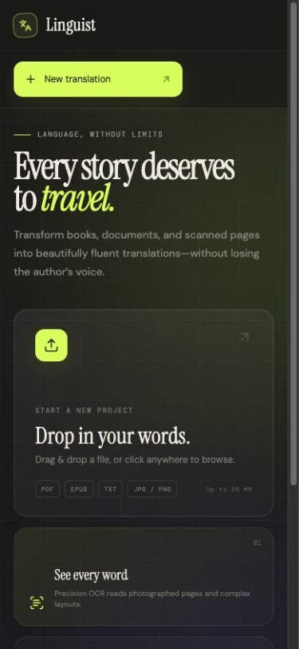

# Linguist

An offline-friendly book translation tool supporting PDF, TXT, and EPUB files. No API keys required — translation runs entirely via a direct algorithmic engine with a free Google Translate fallback.


## Interface

Linguist pairs a focused manuscript workspace with a responsive, editorial interface designed for long-form translation.

<p align="center">
  
</p>

---

## Features

- **Multi-format support** — Upload PDF, TXT, EPUB (with chapter navigation) and image files
- **Offline translation** — Built-in dictionary and heuristic suffix rules for English, Spanish, French, German, Italian, and Latin
- **Online translation with safe fallback** — Uses Google Translate when available and falls back per failed chunk without disabling later requests
- **Chapter-by-chapter** — EPUB chapter navigation with optional full-book sequential translation
- **Export** — Download translated content as TXT, styled PDF, or standards-compliant EPUB
- **OCR** — Image text extraction and translation (requires server-side OCR support)
- **Formatting presets** — Clean spacing, novel indentation, and Markdown output modes

## Getting Started

### Prerequisites

- Node.js >= 18

### Install & Run

```sh
npm install
npm run dev
```

Open [http://localhost:3000](http://localhost:3000).

### Build for Production

```sh
npm run build
npm start
```

---

## How It Works

1. **Upload** a manuscript (PDF, EPUB, TXT, or image)
2. **Select** the source language (or auto-detect it) and target language
3. **Translate** — the engine first tries Google Translate (free, no key), then falls back to offline algorithmic translation
4. **Export** — download the result as TXT, styled PDF, or EPUB

## Supported Languages

Translation is available to/from any language supported by Google Translate. Offline mode (when the network is blocked) supports:

| Language | Code |
|----------|------|
| English  | en   |
| Spanish  | es   |
| French   | fr   |
| German   | de   |
| Italian  | it   |
| Latin    | la   |

## Scripts

| Command           | Description                        |
|-------------------|------------------------------------|
| `npm run dev`     | Start dev server (hot reload)      |
| `npm run build`   | Build frontend + bundle server     |
| `npm start`       | Run production server              |
| `npm run lint`    | Type-check with TypeScript         |
| `npm run clean`   | Remove dist/ and build artifacts   |

## Tech Stack

- **Frontend:** React 19, Vite, Tailwind CSS 4, Lucide icons
- **Backend:** Express, pdf-parse, jsPDF, JSZip
- **Language:** TypeScript

## License

MIT
